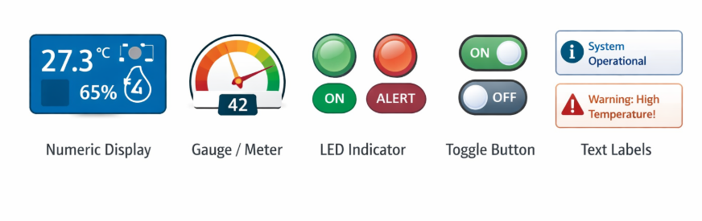

#### Objective

The objective of this experiment is to simulate and understand the **design, structure, and working of an IoT dashboard** used for **remote monitoring of sensor data**.

This experiment focuses on explaining the key dashboard components such as **widgets**, **charts**, and **APIs**, and how these components interact with IoT devices like **ESP8266 / ESP32** through cloud platforms. The experiment enables learners to visualize IoT data and understand how dashboards convert raw sensor data into meaningful insights.

#### Introduction

An **IoT Dashboard** is a graphical user interface that displays real-time and historical data collected from IoT devices deployed in remote locations. It acts as the interaction layer between **cloud-based IoT systems and human users**.

In modern IoT architectures, dashboards play a crucial role by enabling users to monitor system status, analyze trends, and make informed decisions without being physically present near the sensors. Dashboards transform raw numerical sensor data into graphs, indicators, and alerts that are easy to understand.

This experiment demonstrates how an IoT dashboard is created and how it works in coordination with **ESP8266 / ESP32**, cloud platforms, and APIs to support **remote monitoring and data-driven decision making**.

#### Role of IoT Dashboards in Remote Monitoring

IoT dashboards are a critical component of remote monitoring systems. They provide a centralized interface through which users can observe and interact with IoT systems.

The major roles of IoT dashboards include:

- Providing **real-time visibility** of sensor data  
- Enabling **remote access** to IoT devices  
- Supporting **decision making** based on data trends  
- Reducing the need for physical inspection and manual monitoring  
- Improving system efficiency and response time  

Due to these advantages, IoT dashboards are widely used in domains such as **smart cities**, **smart agriculture**, **healthcare monitoring**, **industrial automation**, and **environmental monitoring**.

#### General Architecture of an IoT Dashboard System

A typical IoT dashboard system follows a layered architecture where data flows from physical sensors to end users.

The main components of an IoT dashboard system include:

1. **Sensors**  
   Sensors collect physical or environmental parameters such as temperature, humidity, gas concentration, or motion.

2. **ESP8266 / ESP32 (Edge Device)**  
   The microcontroller reads sensor data, performs basic processing, and sends the data to the cloud.

3. **Cloud Platform**  
   The cloud stores sensor data in databases and manages device communication.

4. **IoT Dashboard**  
   The dashboard retrieves data from the cloud and presents it in a visual format.

5. **APIs**  
   APIs enable structured data exchange between devices, cloud, and dashboard.

This architecture ensures scalability, reliability, and remote accessibility of IoT systems.

#### IoT Dashboard Components

An IoT dashboard is composed of multiple visual and functional elements that work together to present and manage IoT data effectively.

The three most important components of an IoT dashboard are:

- **Widgets**
- **Charts**
- **APIs**

Each component plays a specific role in data visualization, interaction, and communication.

#### Widgets in IoT Dashboards

##### Definition of Widgets

Widgets are individual visual elements displayed on an IoT dashboard. Each widget is designed to represent a specific sensor value, system status, or control function in a clear and intuitive manner.

Widgets provide users with quick access to critical information without requiring detailed data analysis.

##### Types of Widgets

Commonly used widgets in IoT dashboards include:

- **Numeric Display** – Displays sensor values such as temperature or humidity  
- **Gauge / Meter** – Shows sensor values within a predefined range  
- **LED Indicator** – Indicates ON/OFF or normal/alert states  
- **Toggle Button** – Allows users to remotely control devices  
- **Text Labels** – Displays system messages or alerts

 

These widgets simplify real-time monitoring by presenting information visually.

##### Role of Widgets

Widgets help users to:

- Monitor live sensor readings instantly  
- Identify abnormal or critical conditions quickly  
- Interact with IoT devices remotely  
- Improve situational awareness  

Widgets are particularly important for **real-time monitoring applications** where quick response is required.

#### Charts in IoT Dashboards

##### Purpose of Charts

Charts provide a graphical representation of sensor data over time. Unlike widgets that display current values, charts help users analyze trends, patterns, and long-term behavior of IoT systems.

##### Types of Charts

Common chart types used in IoT dashboards include:

- **Line Charts** – Used for time-series sensor data (most common)  
- **Bar Charts** – Used for comparing values across categories  
- **Area Charts** – Used for cumulative data representation  
- **Pie Charts** – Used for percentage-based distribution  

 

Each chart type serves a different analytical purpose.

##### Importance of Charts

Charts enable users to:

- Perform **historical data analysis**  
- Detect anomalies and unusual patterns  
- Evaluate system performance over time  
- Support predictive analysis and planning  

Charts are essential for **long-term monitoring and analytics** in IoT systems.

#### APIs in IoT Dashboards

##### What is an API?

An **API (Application Programming Interface)** is a software interface that allows different systems to communicate with each other. In IoT dashboards, APIs act as a bridge between **IoT devices**, **cloud platforms**, and **dashboard user interfaces**.

##### Role of APIs in IoT Dashboards

APIs are used to:

- Receive sensor data from ESP8266 / ESP32  
- Fetch stored data from cloud databases  
- Update dashboard widgets and charts dynamically  
- Send control commands back to IoT devices  

APIs enable automation, scalability, and interoperability in IoT systems.

##### Types of APIs Used

Common API types used in IoT dashboards include:

- **REST APIs** – Based on HTTP GET and POST methods  
- **MQTT APIs** – Based on publish–subscribe communication  
- **WebSocket APIs** – Used for real-time bidirectional data updates  

The choice of API depends on system requirements such as latency, scalability, and reliability.

#### Data Flow in an IoT Dashboard System

The complete data flow in an IoT dashboard system is as follows:

1. Sensors generate physical or environmental data  
2. ESP8266 / ESP32 transmits data to the cloud  
3. Cloud platform stores data in databases  
4. Dashboard fetches data using APIs  
5. Widgets and charts update dynamically on the user interface  

This continuous data flow enables **real-time remote monitoring** and analysis.

#### Advantages of IoT Dashboards

IoT dashboards provide several advantages, including:

- Remote access to sensor data  
- Real-time system monitoring  
- Improved decision making  
- Reduced operational and maintenance costs  
- Easy visualization of complex data  

These benefits make IoT dashboards an essential component of modern IoT systems.

#### Applications of IoT Dashboards

IoT dashboards are widely used in various application domains such as:

- Smart agriculture monitoring  
- Smart home automation  
- Industrial machine monitoring  
- Healthcare patient monitoring  
- Environmental pollution monitoring  

#### Conclusion

This experiment provides a comprehensive understanding of how IoT dashboards are designed and used for remote monitoring. By studying dashboard architecture, widgets, charts, and APIs, learners gain essential knowledge required to design effective and scalable IoT monitoring systems.

#### References

1. IoT Dashboard Design Principles – IEEE Publications  
2. ThingSpeak Dashboard Documentation  
3. Internet of Things: A Hands-on Approach – Arshdeep Bahga  
4. RESTful Web Services – O’Reilly  
5. Cloud-Based IoT Systems – Springer  

